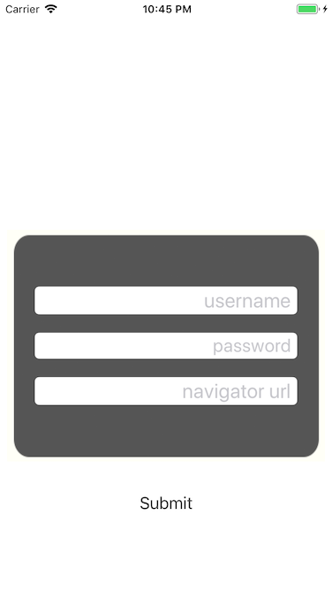
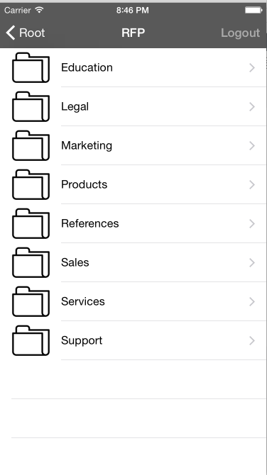
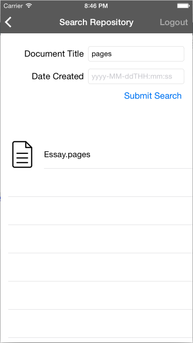

# Sample Application for IBM Navigator Mobile iOS SDK

Sample Application to demonstrate the features of IBM Navigator Mobile iOS SDK

** The IBM Navigator Mobile iOS SDK 3.4.0.7 binary framework, Swift 5.0, and Xcode 13.4.1 or later, are required to compile the sample app. Refer to the [README pdf](/IBMNavigatorMobileiOSSDK_Readme.pdf) for detailed instructions on how to obtain the framework. ** 

## Usage

Simply place IBMECMCore.framework in the same folder as the workspace file (not the project file,) build and run on simulator. You can connect only to IBM Content Navigator V3.0.0 or later (more information [here](https://www.ibm.com/us-en/marketplace/content-navigator))

## Documention
The latest SDK Documentation can be found here: http://ibm-ecm.github.io/ibm-navigator-mobilesdk-sample/ 

## Screenshots

### Login

### Browse

### Search

## License

This Sample Application for IBM Navigator Mobile iOS SDK is intended solely for use with an Apple iOS product and intended to be used in conjunction with officially licensed Apple development tools and further customized and distributed under the terms and conditions of your licensed Apple developer program.

See the [License](/Ready%20Apps%20open%20source%20license.pdf) text for more information about how this application is licensed.

## Misc

The Xcode project is meant to be used with Cocoapods. For simplicity, we have included the 'Pods' generated project. You can generate your own by executing 'pod install' inside the folder with the workspace file. See documentation on how to install cocoapods on your development workstation.
